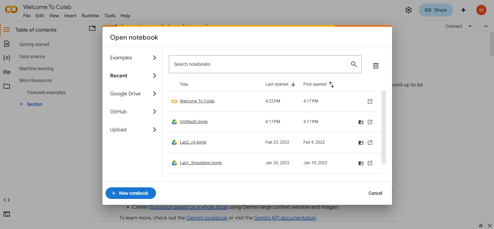
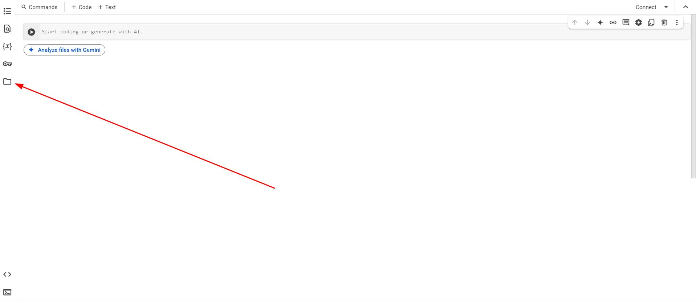
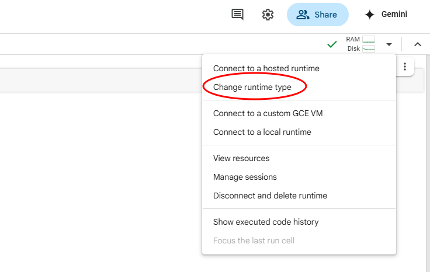
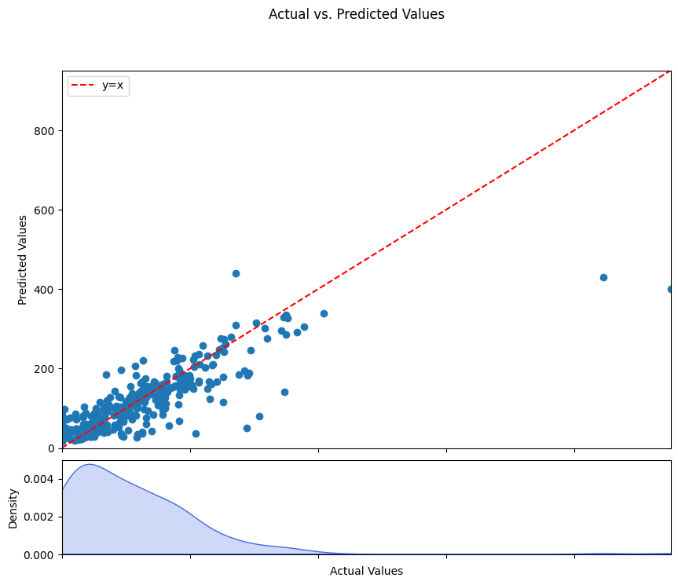
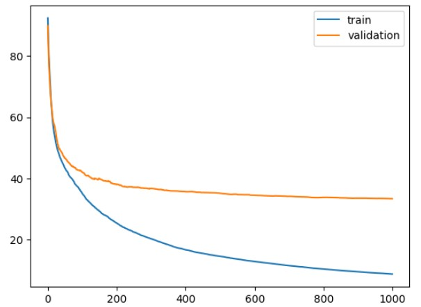
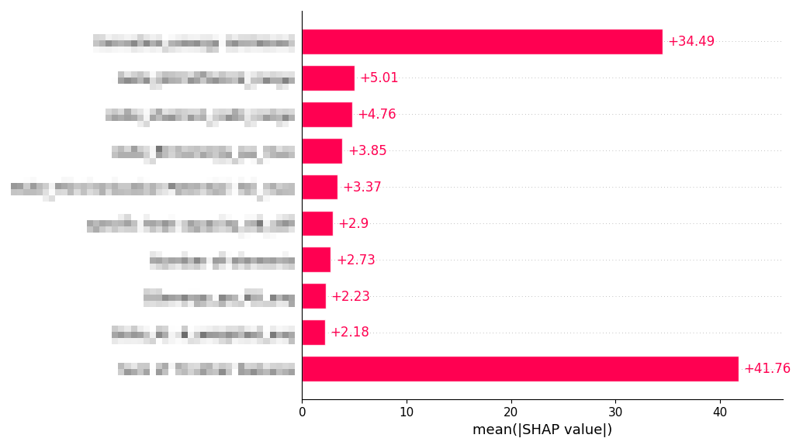
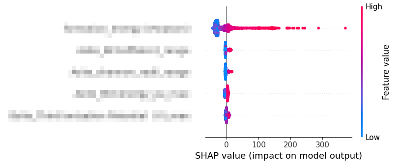
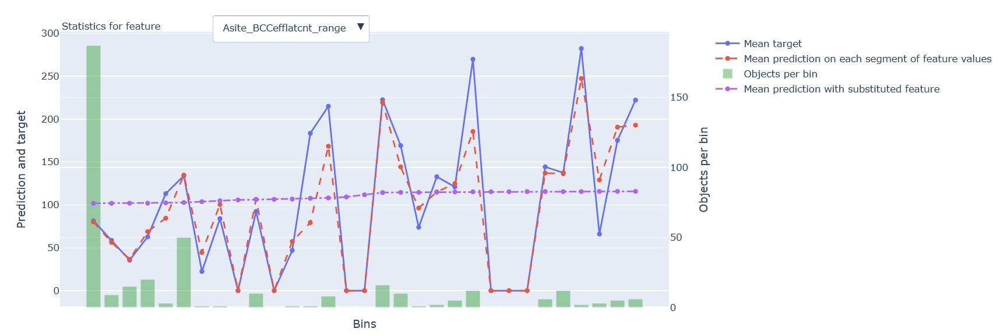

This is a hands-on designed for the Missing Data and Categorical Data for UW MSE 544 Big Data and Materials Informatics. 
In this module.... 

There are 4 questions to answer throughout this module. You can write your answers in markdown cells in your notebook or a separate file like a Word document.

# Setting up Google Colab Notebook
### For this tutorial, we will assume you are using Google Colab. If you would prefer not to use Colab, please talk to the course staff.

First, go to https://colab.research.google.com/ and sign in to your UW Google account. (If you haven't activated your UW Google account, here is the [link](https://uwconnect.uw.edu/it?id=kb_article_view&sysparm_article=KB0034358#getting_started) to connect to the page that has instructions of "To activate your UW Google account follow these steps:"

Then, create a new notebook:



You can name your notebook something nice like `CatBoost_hands_on`

Next, download the dataset:`Perovskite_Stability_with_features.csv` from Canvas's "Missing data and Categorical Data" module 

Colab lets you upload files to your runtime, but they are deleted once it is closed. Instead, we can take advantage of the integrated connection to Google Drive. Let's try to mount your Google Drive with this Notebook:  Go to your Google Drive home and click 'New' in the top left corner. Then, upload the CSV file. Make sure you are signed in to the same Google Account that you are using for Colab


Now we can go back to Colab. Click on the files button on the left side of the window.



You will see the options as shown below. Please click the circled icon and select "Connect to Google Drive" when prompted.


Now you can access your Google Drive in your Colab environment.

Finally, we need install our libraries. Most of what we need is installed in Colab by default. Run the following command in a new cell to install the CatBoost library.
```
%pip install catboost
```
> NOTE: you will need to restart your kernel: go to the top bar and in the `Runtime` menu, select `restart session`. 
> NOTE: In most environments we work in we only need to install packages once. However, with Colab, our environment is deleted when we disconnect, so we will have to do this every time we open our notebook. 

Now we are ready to get to work!
# Familiarize yourself with the data
Our dataset was assembled for the purpose of predicting the stability of perovskites. These materials generally have a composition of $$ABX_3$$ and have a characteristic crystal structure. You can read more about these materials [here](https://en.wikipedia.org/wiki/Perovskite_(structure)). The stability of these materials is quantified by the Energy Above Hull, which is determined using DFT calculations. The lower this value, the more stable the material. The rest of the features in the dataset are properties obtained from [the Materials Project](https://next-gen.materialsproject.org/)

Let's load the data in our jupyter notebook. The file path shown below assumes you saved your dataset to the highest level of your Google Drive. If you put it in some folder, you will have to change the path to point to that folder.
```
import pandas as pd
df = pd.read_csv('./drive/MyDrive/Perovskite_Stability_with_features.csv')
```
We can get an idea of how much data we have by looking at the number of rows and columns using the following:
```
df.shape
```
We can also look at the first few rows of our data using:
```
df.head()
```
You'll notice that some of the features are categorical data about which elements occupy the different sites in the crystal. Some of these values are NaN. While CatBoost automatically handles missing data for numerical features, this doesn't work for categorical data. Luckily, it usually makes sense to treat missing values as their own category and fill the NaNs with something like "None". Here's one way to do this:

```
df.iloc[:, 1:7] = df.iloc[:, 1:7].fillna('None')
```
When you run the df.head(), you might notice that there is one column that lists the composition of the materials. Even though it is quite useful information, this is not categorical data, or numbercial data that can be used by the model, we will need to drop this column by doing: 

```
df = df.drop('Material Composition'],axis=1)
```
# Building our first model

Let's train our first model. First, add the import for the CatBoost library to your notebook.
```
import catboost
```
Next, we'll split our data for training and testing. In this case, we can use a random split. First we'll separate out our input and target features. The 'Material Composition' column is there for identification, but is not useful for our model, so we'll remove it. Our target is the column 'energy_above_hull (meV/atom)'. The rest of the columns will be out input.
```
X = df.drop(['energy_above_hull (meV/atom)'], axis=1)
y = df['energy_above_hull (meV/atom)']
```
We can then use the train_test_split method to split up the data. We'll use 60% for training, 20% for validation, and 20% for testing. Be sure to add the import .
```
from sklearn.model_selection import train_test_split
```
```
X_train_val, X_test, y_train_val, y_test = train_test_split(
    X, y, test_size=0.2, random_state=42
)

X_train, X_val, y_train, y_val = train_test_split(
    X_train_val, y_train_val, test_size=0.25, random_state=42
)
```
Finally, we need to tell the model which columns contain categorical data. One way to do this is by providing a list of the indexes of the columns that contain categorical data. In our X dataframe, the categorical data is in the first 7 columns, so we need to specify indexes 0-6.

```
cat_features = list(range(0,7))
```

Now we can create a model with some default parameters and train it using our data. CatBoost offeres two types of model: classifier and regressor. Since we are performing a regression task, we will use regressor.
```
model = catboost.CatBoostRegressor(iterations=1000,
                                   learning_rate=0.01,
                                   depth=3,
                                   one_hot_max_size = 50,
                                   cat_features=cat_features,
                                   verbose = 100,)
```
Now model is defined, we need to run the model:

```
model.fit(X_train,y_train,eval_set=(X_val,y_val))
```
That didn't take too long, but we can try using the GPU to speed things up. By default, the CPU is used to train the model. Let's adjust our code to take advantage of the GPU! We can do this by adding the parameter `task_type="GPU"`. Additionally, `devices='0'` lets us specify which GPU to use with 0 based indexing. We only have one so we use GPU 0.
```
model = catboost.CatBoostRegressor(iterations=1000,
                                   learning_rate=0.01,
                                   depth=3,
                                    task_type="GPU",
                                   one_hot_max_size = 50,
                                   cat_features=cat_features,
                                   verbose = 100,)
```
If you try to run this now by doing model.fit again, you'll get an error. We need to connect to the GPU. Click on the dropdown in the upper right corner and select "Change runtime type"




Then, select T4 GPU and press save.


Now try performing the training on the GPU. Since we are connecting to new hardware, our runtime will be reset, so we need to re-run the code from the notebook from scratch.

In this case, the CPU seems to be faster. In general, CPU's are designed to handle sequential tasks while GPU's have much more capacity for parallel computing. When training a model like this, there are a lot of sequential tasks that take place. With higher dimensional data, the complexity of each of these tasks increases, making parallel processing power more useful. This means that it is not one size fits all whether GPU or CPU is better. This tradeoff also depends on the specific hardware you have access to. Catboost is designed to perform better with GPU when the data size and dimensionality of the data increases.  

Now, let's see how the model performed. First we need to use it to make predictions based on our test set.
```
y_pred = model.predict(X_test)
```
Next we'll visualize the results. For regression tasks like this, it is nice to visualize the models performance by creating a scatter plot where the x-axis the actual values and the y-axis is the predicted values. If the model was perfect, all of the points would lie on the line y=x, so it is also helpful to include the line for reference. We can also add another curve below to show the density of points along the x-axis using a kernel density estimator. Try to make one of these plots yourself. LLMs like ChatGPT are quite good at tasks like this. As we are using Google Colab, you also can try Gemini, which is the generative AI of Google. This plot will be part of the submission for this hands-on assignment.



> **Question 1:** Write a few sentences describing how you generated your plot. If you used GenAI, say what model you used and qualitatively describe the prompting process. If you used prior knowledge or traditional online resources, explain your thought process and how you approached any parts of the task that you didn't know how to do off the top of your head.

# Optimizing our Model

When we define our model, we have a lot of control over the parameters that we use. These will affect the performance of our model. Lets optimize a few of these to improve the performance of our model. This process is called hyperparameter tuning.

Some common parameters are:
* depth - how large each decision tree is
* iterations - how many trees are added to the ensemble
* learning_rate - how much each added tree can affect the prediction
* l2_leaf_reg - adds a penalty that prevents assigning too much weight to one feature, which is useful for preventing overfitting

There are many different ways to perform hyperparameter tuning. Often, people will search through a set of combinations systematically to see what gives the best results. We'll take a simpler, more manual approach to build our intuition on how these parameters affect our model.

First, define a new model with the following parameters:

```
params = {"iterations": 1000,
          "depth": 3,
          "learning_rate": 0.1,
          "l2_leaf_reg": 1,
          "one_hot_max_size": 50,
          "verbose": 100,
          "loss_function": "RMSE",
          "cat_features": cat_features}
model2 = catboost.CatBoostRegressor(**params)
```

Then fit it as we did before. When choosing what parameters to use, it is important to be careful about overfitting. Overfitting occurs when the model performs much better on the training data than it does on unseen data. Ideally, our model would perform the same on the training and validation/test data. In reality, models will naturally perform better on their training data. This is fine as long as the performance doesn't diverge too much. How much overfitting is acceptable is subjective and depends on the type of model, the dataset, and what you are trying to accomplish. 

Let's take a look at the fit of our model by plotting the training and validation curves. The method `get_evals_result()` will give us a dictionary containing the RMSE for both the training data and validation data at each iteration of our model. These are the same numbers that are output when we trained the model. We can plot it like this:

```
scores = model2.get_evals_result()
plt.plot(scores['learn']['RMSE'], label='train')
plt.plot(scores['validation']['RMSE'], label='validation')
plt.legend()
```

You should see something like this:




See how the validation performance levels off, while the training performance continues to improve? This is indicative overfitting.

Change the *learning rate* to .01 and train a new model. This should prevent the model from memorizing the training data too quickly.

Observe how this has affected the train and test curves. Next, let's try increasing the *depth* to 6 so that each tree has more predictive power.

Again, observe how this has affected the train and test curves. Let's try increasing the *l2_leaf_reg*. There is a balance here, as setting it too high can again lead to greater errors. Play around with this and choose a value that you think gives a good balance between performance and overfitting. There is no one right answer here, use your intuition and don't spend too much time trying to find a perfect value!

> **Question 2:** Write one sentence describing how each hyperparameter change affected the train and test curves. List the value you chose for *l2_leaf_reg* and why you chose it.

# Understanding Feature Importance

Now that we have an optimized model, let's look at what features contribute most the to outcome. We will use SHAP values to accomplish this. SHAP values can be used to explain many different machine learning algorithms. CatBoost makes it easy for us to work with SHAP values.

First, import the SHAP library

```
import shap
```

We first create an Explainer object for our model, then pass it our data to get the SHAP values.

```
explainer = shap.Explainer(model)
shap_values = explainer(X_train)
```

Now we can use the shap library to generate some plots to help us understand how our features contribute to the final prediction. Try:
```
shap.plots.bar(shap_values)
```



This gives us a bar chart of each feature's average contribution to the final prediction. There are many other plots as well. Another useful one is the summary plot (also called a beeswarm plot). Try it out:
```
shap.summary_plot(shap_values, max_display=5)
```



On this plot, for each feature, there is a dot for every perovskite material (row) from our data. The x-axis is the impact that the feature had on the prediction for that material. The color of the dot shows the relative value of that feature for that material. This plot not only helps us identify which features are more impactful but how exactly the outcome is being affected.

> **Question 3:** Choose one of the features and explain in a few sentences what we can learn from the summary plot about how your chosen feature affects perovskite stability

CatBoost also offers a different kind of plot to help us understand the feature importance. It is generated using the method `calc_feature_statistics`

In most Jupyter environments, the plot can be generated using:

```
model5.calc_feature_statistics(X, y, feature, plot=True)
```
Because of a quirk in the way Colab works, we have to add a few lines of code to get it to work.

First, define a new function:

```
def enable_plotly_in_cell():
  import IPython
  from plotly.offline import init_notebook_mode
  display(IPython.core.display.HTML('''<script src="/static/components/requirejs/require.js"></script>'''))
  init_notebook_mode(connected=False)
```

Now we can generate our plot like this:

```
enable_plotly_in_cell()
feature = 'Asite_BCCefflatcnt_range'
x = model5.calc_feature_statistics(X, y, feature, plot=True)
```

It will look something like this:



> **Question 4:** Generate two of these plots - one for a very important feature and one for an unimportant feature. Comment on the difference between the two plots.
